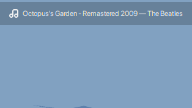
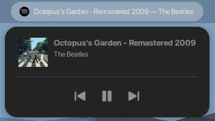
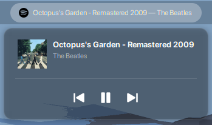

<div align="center">

<!-- Replace with your logo once ready -->
<!--  -->

# Gnomify

**Spotify controls for the GNOME 50 panel**


</div>

---

Gnomify brings Spotify into your GNOME panel — shows the current track, cover art, and playback controls. Disappears automatically when Spotify is closed.

## Preview

**Solid mode** (follows system theme)




**Transparent mode** (frosted glass)



## Features

- Live track title + artist display in the top panel
- Dropdown menu with cover art, track info, and playback controls
- Play / pause / next / previous buttons
- Buttons auto-dim when an action isn't available
- Automatically appears and disappears with Spotify
- Transparent frosted glass mode with adjustable opacity

## Installation

[Download the files](https://github.com/psousa13/gnomify/archive/refs/heads/main.zip) and extract them to `~/.local/share/gnome-shell/extensions/gnomify@psousa13`, or clone the repository:

```bash
git clone https://github.com/psousa13/gnomify.git ~/.local/share/gnome-shell/extensions/gnomify@psousa13
```

Then compile the schema and enable the extension:

```bash
glib-compile-schemas ~/.local/share/gnome-shell/extensions/gnomify@psousa13/schemas/
gnome-extensions enable gnomify@psousa13
```

Restart GNOME Shell to apply — on Wayland log out and back in, on X11 press `Alt+F2`, type `r` and hit Enter.

## Files

| File | Purpose |
|------|---------|
| `metadata.json` | Extension manifest (UUID, supported shell versions) |
| `extension.js` | Panel button + dropdown menu UI |
| `mpris.js` | MPRIS2 D-Bus wrapper + player manager |
| `prefs.js` | Preferences window (Appearance + About) |
| `stylesheet.css` | Panel and menu styling |
| `spotify-logo.svg` | Spotify logo used in the panel |
| `schemas/*.gschema.xml` | GSettings schema |

## Notes

- Open Spotify and start playback — Gnomify will appear in the panel automatically.
- Spotify's Linux clients (official deb/snap/flatpak) all expose MPRIS by default, so no extra configuration is needed.
- Switch between solid and transparent mode anytime in the extension preferences.

---

<div align="center">
  <sub>Made by <a href="https://github.com/psousa13">psousa13</a></sub>
</div>
